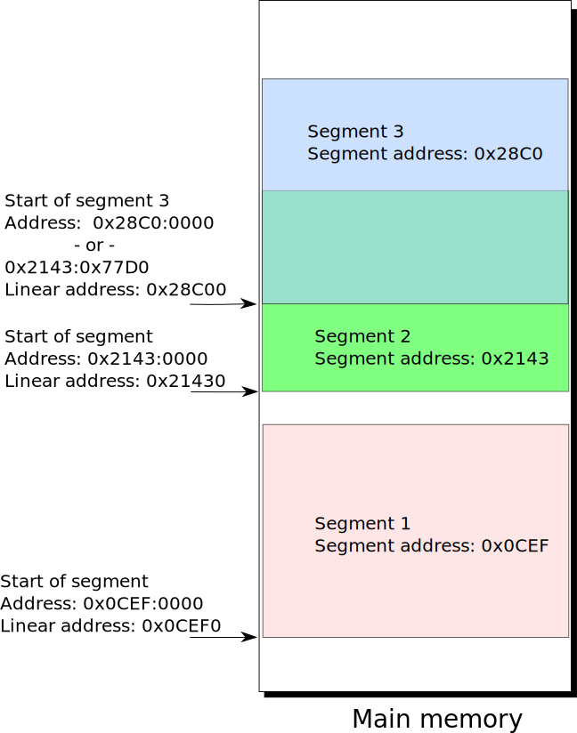
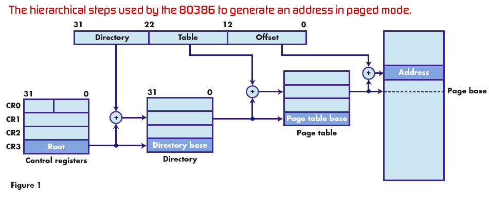

# CS235: Lecture 3

## Intoduction to Memory modes
<!--- 
> 
--->

> 

____
# Protected Mode Memory Addressing:
> Segment register contains a selector that selects a descriptor from the descriptor table.
> The descriptor contains information about the segment, e.g., it's base address, length and access rights.
> The offset can be 32-bits.

> 

## Segment Descriptors in Protected Mode:

> 

## Segment Registers in Protected Mode:
> The 13 bit descriptor index selects one of up to 8K descriptors in either the GDT and LDT, as specified by the TI bit.

>> Therefore, these 14 bits allows access to 16K 8-byte descriptors.

> 

## Segmentation Address Translation:
> + Programmer invisible registers:
>> - The other registers enclosed by the red-dotted line are part of the descriptor cache.
>>> * The cache is used to reduce the number of actual memory references needed to construct the physical address.
 

>> - There is one cache register for each of the 6 segment registers, CS, DS, etc. and the LDTR (Local Descriptor Table Register) and TR (Task Register) selectors.
 

>>> * The base address, limit and access rights of the descriptor are loaded from memory every time the corresponding selector changes.
 

>> - The LDTR and TR selectors refer to special system descriptors in the GDT.

>>> * These registers provide hardware acceleration support for task switching.
 

>> - Let's first consider how LDTs are used to extend the address space of individual tasks.

>  

## Segmentation Address Translation:
>  

## Local Descriptor Tables:
The LDTR selector indexes a GDT system descriptor describing the segment containing the LDT while the cache stores the actual LDT descriptor.
>  
> 

____

# 80286 protected mode example: 

> 

# Paging and Virtual Memory:

> 

# Paging address translation:

> 

# Reference: 
<http://ece-research.unm.edu/jimp/310/slides/micro_arch2.html>