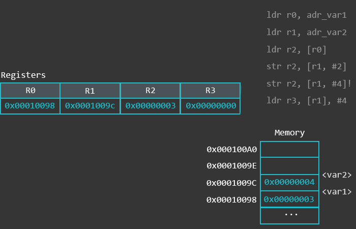
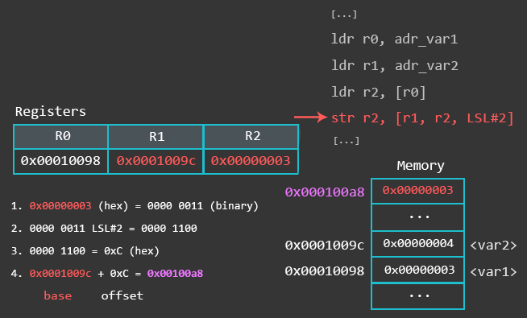

# CS235: Topic 4: Intel x86 addressing modes
<!--- 
> 
--->

> 
____

# 1. Load and store operation:
LDR is used to load something from memory into a register, and STR is used to store something from a register to a memory address. The operand on the right hand side is the source while the operand on the left is the destination. 

Intrucitons with memory locations and registers are highligted in the gif below. 

> 
The complete x86 addressing modes should be consulted from the book. 

# 2. Immediate value as the offset
In this case, immediate value like #4 is passed as an offset. The value of the offset is added in the conetents of the register (R0 is this case). After addition the number is poiting towards the source memory destination. 

> 

# 3. Register as offset:
In register offset instead of the immedidate value as offset, the contents of the register acts as offset. Contents of the both registers are added and the result will point towards the final source address. 
> 

# 4. indexed Register as offset:

> 
_____
# Addressing modes examples:

> 

reference: 
<https://azeria-labs.com/memory-instructions-load-and-store-part-4/>